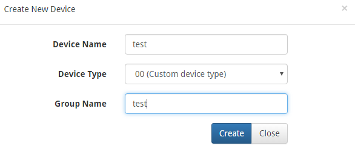
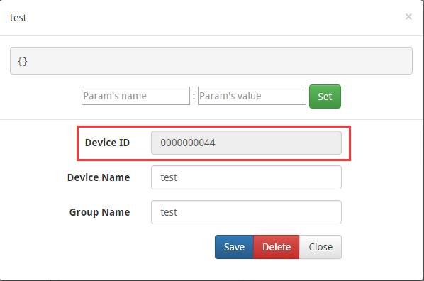
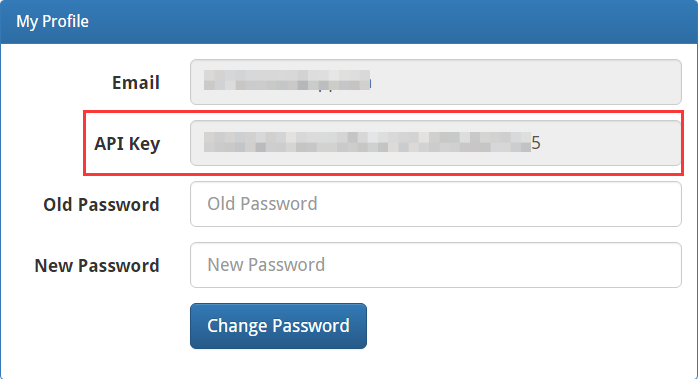
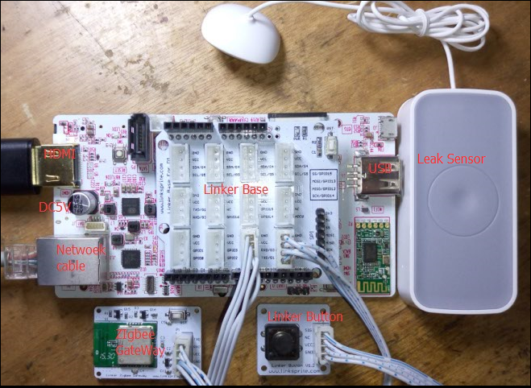
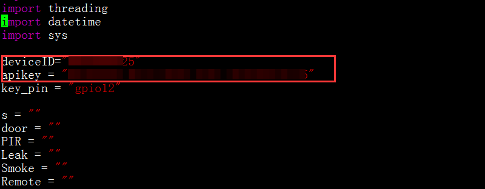
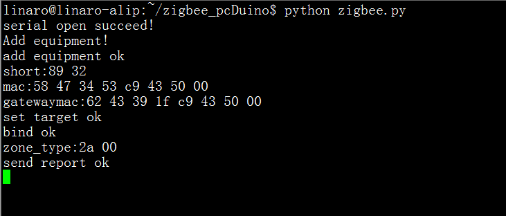
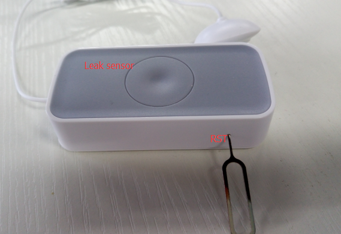
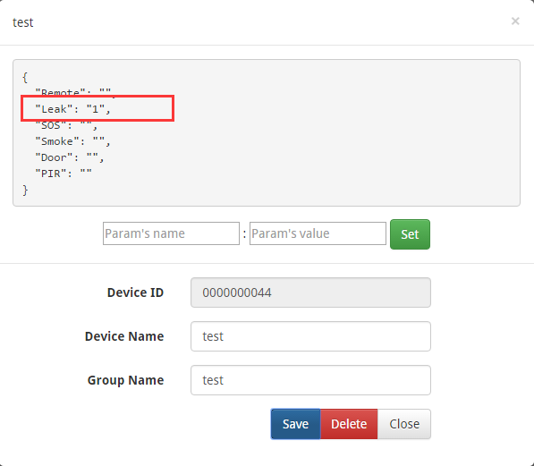

# Linker ZigBee Gateway Module


Linker ZigBee gateway module is one kind of Linker modules which can communicate with up to 32 ZigBee node devices. It is powered by Marvell 88MZ100 ZigBee microcontroller SoC chip. This ZigBee offers advantages for many application scenarios, including lighting control, smart metering, home/building automation, remote controls and health care applications.

## Features
* Marvell MZ100 ZigBee SoC chip
	* A ZigBee compliant platform and IEEE802.15.4-2003/2006 transceiver
	* 32 bit ARM Cortex M3 microcontroller running at 32 or 64 MHz with Marvell’s proven peripheral IPs 
	* On-chip DC-DC converter that can directly take input range from 2 volt to 3.6 volt 
* UART serial communication protocol
* Linker port with 4 pins
* 3.3V

## Tutorial
we will show how to interface Deepcam ZigBee sensors to LinkSpriteIO using the Linker ZigBee gateway, and serves as a basic framework for home automation sensors application.


### Prerequisites
* [pcDuino3B](http://store.cutedigi.com/pcduino3b-a20-single-board-computer-supports-arduino-programming-with-gbps-mac/) or [pcDuino8 Uno](http://store.cutedigi.com/pcduino8-uno-8-core-single-board-computer-arduino-headers-ubuntu-android/) x 1  
* [ZigBee Gateway module](http://store.cutedigi.com/linker-zigbee-module-for-deepcam-zigbee-sensors/) x 1 
* [Linker Button](http://store.cutedigi.com/button-module-of-linker-kit-for-pcduino-arduino/) x 1  
* [Linker Base shield](http://store.cutedigi.com/base-shield-of-linker-kit-for-pcduino-arduino/) x 1
* [ZigBee water leaking detector](http://store.cutedigi.com/water-detector/) x 1


For simplicity, this tutorial uses only one ZigBee sensor: ZigBee water leak detector.

### Steps

#### 1. Register and login www.linksprite.com
Go to www.linksprite.io, create an account if you don’t have one, and login, create a DIY device. The type is **00(Custom device type)**. The device name and device group can be arbitrary.  The following summarizes:

* Go to **www.linksprite.io**
* Create an account and login
* Create a device with type 00, and arbitrary device name and group name.



* Obtain deviceID



* Obtain apikey



#### 2. Hardware connection
According to the following diagram to connect pcDuino3B, ZigBee gateway and other equipment.

 

#### 3. Download the ZigBee gateway demo code
Turn on pcDuino3B, open a terminal and download the zigBee gateway code from the [github](https://github.com/YaoQ/zigbee.git). We also need to modify the **deviceID** and **apikey** with yours, run the code and add a ZigBee device.

* Download source files  
`git clone https://github.com/YaoQ/zigbee.git`

* Modify apikey and deviceID using the ones obtained above.
 
```
	cd zigbee           
	vim zigbee.py  
```  



**Note**: You have to install [pyserial](https://pypi.python.org/pypi/pyserial) in the system.

#### 4. Add the first device  

* Run the ZigBee.py program  
```
python zigbee.py   
```  
  

Press and hold the **RST pin** hole of the water sensor until the green LED blink fast.  Now we can start to add device by pressing the linker button:

 
  

Till now, we added water detector successfully to the ZigBee gateway. Now we can observe the status of the water detector on www.linksprite.io web portal. Water detector is a water leakage detector, when we place it on the place that has water, we can see status change on the web portal.



#### 5. How to add more ZigBee devices
Follow the steps above, we have been able to add a device, and we continue to add other devices. In the case of ZigBee.py program:

* Press and hold the reset for several seconds, the sensor's Green LED flashing rapidly, enter the reset State
* Press Linker button add equipment，wait for complete
* When you are finished adding the device, get the zone type information, equipment added
* At this point, the gateway can already get sensor alarm information, and can be uploaded to the LinkSprite.io

More sensors can be found at [here](http://store.cutedigi.com/sensor/).

